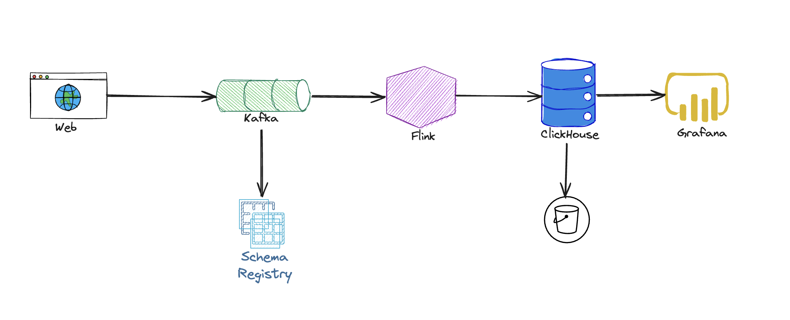
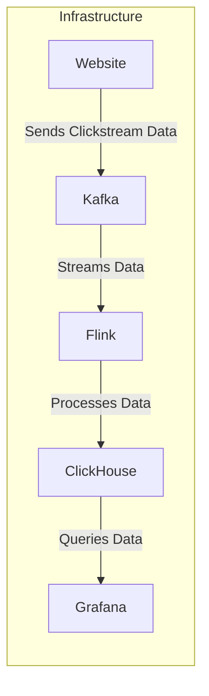

# Clickstreamer


This project captures and processes clickstream data to provide real-time insights into user behavior on a website. The data is ingested from a streaming source, processed using Flink, and stored in ClickHouse for fast querying and analysis.

## Prerequisites

- Java: `java11`
- Kafka: `confluentinc/cp-kafka:7.4.1`
- Flink: `1.17.2-java11`
- ClickHouse Server: `24.7.3`
- ClickHouse Client: `21.3.20`
- Grafana: `11.1.1`

## Quickstart

Now launch Confluent Platform by running the following command. Note the --build argument which automatically builds the Docker image for Kafka Connect and the bundled kafka-connect-datagen connector.

### Step 1: Run the container

```bash
docker compose up -d --build
```

### Step 2: Write the event

Create the Kafka Connect Datagen source connector. It automatically creates the Kafka topic pageviews and produces data to it with a schema specification from https://github.com/confluentinc/kafka-connect-datagen/blob/master/src/main/resources/pageviews_schema.avro

```bash
curl -i -X PUT http://localhost:8083/connectors/datagen_local_01/config \
     -H "Content-Type: application/json" \
     -d '{
            "connector.class": "io.confluent.kafka.connect.datagen.DatagenConnector",
            "key.converter": "org.apache.kafka.connect.storage.StringConverter",
            "kafka.topic": "pageviews",
            "quickstart": "pageviews",
            "max.interval": 1000,
            "iterations": 10000000,
            "tasks.max": "1"
        }'
```

Check that the connector is running:
```bash
curl -s http://localhost:8083/connectors/datagen_local_01/status
```

### Step 3: Consume the event

Now that the kafka-connect-datagen is running, run the Kafka Avro console consumer to see the data streaming into the Kafka topic.
```bash
docker exec -it connect kafka-avro-console-consumer \
 --bootstrap-server broker:9092 \
 --property schema.registry.url=http://schema-registry:8081 \
 --topic pageviews \
 --property print.key=true \
 --property key.deserializer=org.apache.kafka.common.serialization.StringDeserializer \
 --property key.separator=" : " \
 --max-messages 10
```

You should see that the state is RUNNING for both connector and tasks elements
```
{"name":"datagen_local_01","connector":{"state":"RUNNING","worker_id":"connect:8083"},"tasks":[{"id":0,"state":"RUNNING","worker_id":"connect:8083"}],"type":"source"}
```


## Architecture





## Challenges

### Data Generation and Quality

- **Challenge**: Ensuring the data generated by DataGen is realistic and representative of actual clickstream data can be tricky. Inaccurate or unrealistic data can skew your analysis and insights.
- **Solution**: Fine-tune DataGen configurations to create diverse and realistic data patterns. Validate the generated data against real-world scenarios to ensure quality.

### Schema Evolution
- **Challenge**: Managing schema evolution with Confluent Schema Registry can be complex, especially if your clickstream data schema changes over time.
- **Solution**: Use schema evolution best practices, such as backward and forward compatibility. Implement versioning and testing strategies to handle schema changes smoothly.

### Data Ingestion and Processing
- **Challenge**: Setting up Kafka for high-throughput and low-latency data ingestion and ensuring Flink processes the data efficiently can be demanding.
- **Solution**: Properly configure Kafka brokers and topics for your expected load. Optimize Flink job configurations for performance and fault tolerance. Monitor the pipeline to detect and address any bottlenecks.

### Data Storage and Querying
- **Challenge**: Integrating ClickHouse for efficient data storage and querying while ensuring it handles the volume and velocity of clickstream data effectively.
- **Solution**: Design your ClickHouse schema to support fast querying and efficient storage. Regularly monitor and optimize performance.

### Visualization and Monitoring
- **Challenge**: Creating meaningful visualizations in Grafana and ensuring they reflect real-time data accurately can be challenging.
- **Solution**: Design dashboards that align with your key metrics and use Grafana’s features to visualize data effectively. Set up alerts and monitoring to keep track of data pipeline health and performance.