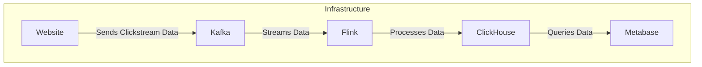

# Clickstreamer

This project captures and processes clickstream data to provide real-time insights into user behavior on a website. The data is ingested from a streaming source, processed using Flink, and stored in ClickHouse for fast querying and analysis.

## Architecture

